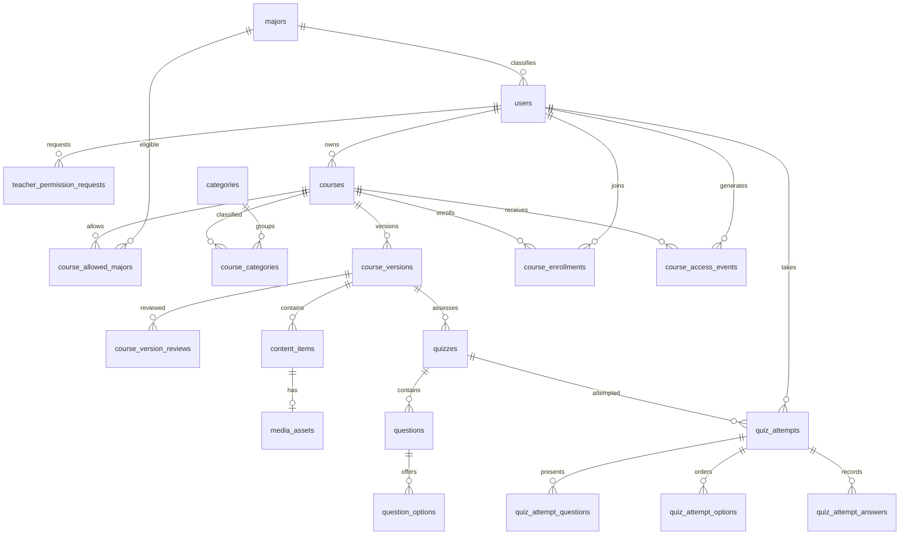

# Institute X E-Learning Database Schema

**Schema version:** 1.3
**Updated:** August 27, 2026
**Database:** PostgreSQL  
**Source of truth:** Institute X E-Learning SRS v1.5

## 1. Design rules

- Institute SSO only; no local passwords.
- Exactly one role per user: `STUDENT`, `TEACHER`, `APPROVER`, or `OWNER`.
- Course eligibility is `OPEN` for every active Student or `LIMITED` to selected Majors.
- Teachers require approved permission before creating Courses.
- Published Versions are immutable; approval automatically publishes a submitted Version.
- Pre-Test: one completed attempt and no passing threshold. Post-Test: unlimited attempts and 80% to pass.
- Answers and randomized presentation order are retained for auditability.
- Media is private in S3-compatible storage. All timestamps use UTC `TIMESTAMPTZ`.
- Courses may belong to one or more reusable Categories through a normalized join table.
- Existing Courses are assigned to the `Uncategorized` fallback Category during migration.

## 2. Enumerations

| Enum | Values |
|---|---|
| `USER_ROLE` | `STUDENT`, `TEACHER`, `APPROVER`, `OWNER` |
| `ACCOUNT_STATUS` | `ACTIVE`, `INACTIVE` |
| `TEACHER_PERMISSION_STATUS` | `PENDING`, `APPROVED`, `REJECTED`, `REVOKED` |
| `COURSE_VERSION_STATUS` | `DRAFT`, `SUBMITTED`, `REJECTED`, `PUBLISHED`, `SUPERSEDED` |
| `COURSE_ELIGIBILITY_MODE` | `OPEN`, `LIMITED` |
| `CONTENT_TYPE` | `TEXT`, `VIDEO`, `AUDIO`, `IMAGE`, `DOCUMENT` |
| `ASSET_STATUS` | `PENDING`, `READY`, `FAILED`, `DELETED` |
| `QUIZ_TYPE` | `PRE_TEST`, `POST_TEST` |
| `QUESTION_TYPE` | `MULTIPLE_CHOICE` |
| `QUIZ_RESULT` | `COMPLETED`, `PASS`, `NOT_PASS` |
| `REVIEW_DECISION` | `APPROVED`, `REJECTED` |

## 3. Tables

### `majors`

| Column | Type | Constraints |
|---|---|---|
| `major_id` | UUID | PK |
| `major_code` | VARCHAR(50) | NOT NULL, UNIQUE |
| `major_name` | VARCHAR(255) | NOT NULL, UNIQUE |
| `created_at` | TIMESTAMPTZ | NOT NULL, default now |

### `users`

| Column | Type | Constraints |
|---|---|---|
| `user_id` | UUID | PK |
| `sso_subject` | VARCHAR(255) | NOT NULL, UNIQUE |
| `university_email` | VARCHAR(320) | NOT NULL, UNIQUE |
| `full_name` | VARCHAR(255) | NOT NULL |
| `role` | `USER_ROLE` | NOT NULL |
| `account_status` | `ACCOUNT_STATUS` | NOT NULL |
| `major_id` | UUID | NULL, FK → `majors.major_id` |
| `created_at` | TIMESTAMPTZ | NOT NULL, default now |
| `updated_at` | TIMESTAMPTZ | NOT NULL, default now |

`major_id` is required for `STUDENT`. Only `ACTIVE` users may access the application.

### `teacher_permission_requests`

Retains every Teacher request and decision.

| Column | Type | Constraints |
|---|---|---|
| `request_id` | UUID | PK |
| `teacher_id` | UUID | NOT NULL, FK → `users.user_id` |
| `status` | `TEACHER_PERMISSION_STATUS` | NOT NULL |
| `request_message` | TEXT | NULL |
| `reviewed_by` | UUID | NULL, FK → `users.user_id` |
| `review_comment` | TEXT | NULL |
| `requested_at` | TIMESTAMPTZ | NOT NULL, default now |
| `reviewed_at` | TIMESTAMPTZ | NULL |

Partial unique index on `teacher_id` where `status = PENDING`. Only a `TEACHER` may request and only an `APPROVER` may review. Course creation requires the latest effective permission to be `APPROVED`.

### `courses`

| Column | Type | Constraints |
|---|---|---|
| `course_id` | UUID | PK |
| `teacher_id` | UUID | NOT NULL, FK → `users.user_id` |
| `eligibility_mode` | `COURSE_ELIGIBILITY_MODE` | NOT NULL, default `LIMITED` |
| `created_at` | TIMESTAMPTZ | NOT NULL, default now |
| `archived_at` | TIMESTAMPTZ | NULL |

### `categories`

| Column | Type | Constraints |
|---|---|---|
| `category_id` | UUID | PK, generated |
| `slug` | VARCHAR(100) | NOT NULL, UNIQUE |
| `name` | VARCHAR(255) | NOT NULL, UNIQUE |
| `created_at` | TIMESTAMPTZ | NOT NULL, default now |
| `updated_at` | TIMESTAMPTZ | NOT NULL, updated automatically |

Categories are Owner-managed taxonomy labels; authenticated users may list them.

### `course_allowed_majors`

| Column | Type | Constraints |
|---|---|---|
| `course_id` | UUID | PK part, FK → `courses.course_id` |
| `major_id` | UUID | PK part, FK → `majors.major_id` |

Primary key: (`course_id`, `major_id`). `OPEN` Courses have no rows in this table. Every `LIMITED` Course must have at least one eligible Major before submission.

### `course_categories`

| Column | Type | Constraints |
|---|---|---|
| `course_id` | UUID | PK part, FK → `courses.course_id`, cascade on Course delete |
| `category_id` | UUID | PK part, FK → `categories.category_id`, deletion restricted |

Primary key: (`course_id`, `category_id`). New Courses require at least one Category.

### `course_versions`

| Column | Type | Constraints |
|---|---|---|
| `version_id` | UUID | PK |
| `course_id` | UUID | NOT NULL, FK → `courses.course_id` |
| `version_number` | INT | NOT NULL, CHECK > 0 |
| `title` | VARCHAR(255) | NOT NULL |
| `description` | TEXT | NULL |
| `status` | `COURSE_VERSION_STATUS` | NOT NULL, default `DRAFT` |
| `submitted_at` | TIMESTAMPTZ | NULL |
| `published_at` | TIMESTAMPTZ | NULL |
| `created_at` | TIMESTAMPTZ | NOT NULL, default now |
| `updated_at` | TIMESTAMPTZ | NOT NULL, default now |

Unique (`course_id`, `version_number`) and partial unique index on `course_id` where `status = PUBLISHED`. Allowed transitions are `DRAFT → SUBMITTED`, `SUBMITTED → REJECTED`, `SUBMITTED → PUBLISHED`, `REJECTED → DRAFT`, and `PUBLISHED → SUPERSEDED`. Approval supersedes the old publication and publishes the new Version atomically.

### `course_version_reviews`

| Column | Type | Constraints |
|---|---|---|
| `review_id` | UUID | PK |
| `version_id` | UUID | NOT NULL, FK → `course_versions.version_id` |
| `submission_number` | INT | NOT NULL, CHECK > 0 |
| `submitted_at` | TIMESTAMPTZ | NOT NULL |
| `reviewed_by` | UUID | NULL, FK → `users.user_id` |
| `decision` | `REVIEW_DECISION` | NULL |
| `review_comment` | TEXT | NULL |
| `reviewed_at` | TIMESTAMPTZ | NULL |

Unique (`version_id`, `submission_number`). This preserves every rejection and resubmission.

### `content_items`

| Column | Type | Constraints |
|---|---|---|
| `content_item_id` | UUID | PK |
| `version_id` | UUID | NOT NULL, FK → `course_versions.version_id` |
| `content_type` | `CONTENT_TYPE` | NOT NULL |
| `title` | VARCHAR(255) | NULL |
| `text_body` | TEXT | NULL |
| `position` | INT | NOT NULL, CHECK > 0 |
| `created_at` | TIMESTAMPTZ | NOT NULL, default now |
| `updated_at` | TIMESTAMPTZ | NOT NULL, default now |

Unique (`version_id`, `position`). `text_body` is required for `TEXT` and null for media types.

### `media_assets`

| Column | Type | Constraints |
|---|---|---|
| `asset_id` | UUID | PK |
| `content_item_id` | UUID | NOT NULL, UNIQUE, FK → `content_items.content_item_id` |
| `file_name` | VARCHAR(255) | NOT NULL |
| `mime_type` | VARCHAR(255) | NOT NULL |
| `storage_key` | VARCHAR(1024) | NOT NULL, UNIQUE |
| `size_bytes` | BIGINT | NOT NULL, CHECK 1..1,073,741,824 |
| `status` | `ASSET_STATUS` | NOT NULL, default `PENDING` |
| `created_at` | TIMESTAMPTZ | NOT NULL, default now |

The application transactionally enforces a maximum sum of 1,073,741,824 bytes (1 GiB) for all non-deleted assets across all Versions of a Course. Objects are private; Students receive short-lived authorized view/stream URLs only.

### `quizzes`

| Column | Type | Constraints |
|---|---|---|
| `quiz_id` | UUID | PK |
| `version_id` | UUID | NOT NULL, FK → `course_versions.version_id` |
| `quiz_type` | `QUIZ_TYPE` | NOT NULL |
| `title` | VARCHAR(255) | NOT NULL |
| `duration_seconds` | INT | NULL, CHECK > 0 |
| `randomize_questions` | BOOLEAN | NOT NULL, default true |
| `randomize_options` | BOOLEAN | NOT NULL, default true |
| `created_at` | TIMESTAMPTZ | NOT NULL, default now |

Unique (`version_id`, `quiz_type`). Null duration means untimed. Pre-Test has no threshold; Post-Test passes at 80%.

### `questions`

| Column | Type | Constraints |
|---|---|---|
| `question_id` | UUID | PK |
| `quiz_id` | UUID | NOT NULL, FK → `quizzes.quiz_id` |
| `question_text` | TEXT | NOT NULL |
| `question_type` | `QUESTION_TYPE` | NOT NULL, default `MULTIPLE_CHOICE` |
| `points` | NUMERIC(10,2) | NOT NULL, CHECK > 0 |
| `position` | INT | NOT NULL, CHECK > 0 |

Unique (`quiz_id`, `position`).

### `question_options`

| Column | Type | Constraints |
|---|---|---|
| `option_id` | UUID | PK |
| `question_id` | UUID | NOT NULL, FK → `questions.question_id` |
| `option_text` | TEXT | NOT NULL |
| `is_correct` | BOOLEAN | NOT NULL |
| `position` | INT | NOT NULL, CHECK > 0 |

Unique (`question_id`, `position`). Each question requires at least two options and exactly one correct option before submission. `is_correct` is never returned through Student-facing APIs.

### `course_enrollments`

Created once when an eligible Student first enters a published Course. Repeat visits are not new enrollments.

| Column | Type | Constraints |
|---|---|---|
| `enrollment_id` | UUID | PK |
| `course_id` | UUID | NOT NULL, FK → `courses.course_id` |
| `student_id` | UUID | NOT NULL, FK → `users.user_id` |
| `enrolled_at` | TIMESTAMPTZ | NOT NULL, default now |

Unique (`course_id`, `student_id`); index (`student_id`, `enrolled_at`). Popularity counts enrollments grouped by Course.

### `quiz_attempts`

| Column | Type | Constraints |
|---|---|---|
| `attempt_id` | UUID | PK |
| `quiz_id` | UUID | NOT NULL, FK → `quizzes.quiz_id` |
| `student_id` | UUID | NOT NULL, FK → `users.user_id` |
| `score` | NUMERIC(5,2) | NULL, CHECK 0..100 |
| `result` | `QUIZ_RESULT` | NULL |
| `started_at` | TIMESTAMPTZ | NOT NULL, default now |
| `expires_at` | TIMESTAMPTZ | NULL |
| `submitted_at` | TIMESTAMPTZ | NULL |

Index (`quiz_id`, `student_id`, `submitted_at`). A transactional rule permits only one submitted Pre-Test per Student/Quiz; Post-Test attempts are unlimited. Pre-Test result is `COMPLETED`; Post-Test result is `PASS` at ≥80 and `NOT_PASS` below 80. The server rejects late timed submissions.

### `quiz_attempt_questions`

| Column | Type | Constraints |
|---|---|---|
| `attempt_id` | UUID | PK part, FK → `quiz_attempts.attempt_id` |
| `question_id` | UUID | PK part, FK → `questions.question_id` |
| `display_position` | INT | NOT NULL, CHECK > 0 |

Unique (`attempt_id`, `display_position`).

### `quiz_attempt_options`

| Column | Type | Constraints |
|---|---|---|
| `attempt_id` | UUID | PK part, FK → `quiz_attempts.attempt_id` |
| `question_id` | UUID | PK part, FK → `questions.question_id` |
| `option_id` | UUID | PK part, FK → `question_options.option_id` |
| `display_position` | INT | NOT NULL, CHECK > 0 |

Unique (`attempt_id`, `question_id`, `display_position`).

### `quiz_attempt_answers`

| Column | Type | Constraints |
|---|---|---|
| `attempt_id` | UUID | PK part, FK → `quiz_attempts.attempt_id` |
| `question_id` | UUID | PK part, FK → `questions.question_id` |
| `selected_option_id` | UUID | NOT NULL, FK → `question_options.option_id` |
| `is_correct` | BOOLEAN | NOT NULL |
| `points_awarded` | NUMERIC(10,2) | NOT NULL, CHECK >= 0 |
| `answered_at` | TIMESTAMPTZ | NOT NULL, default now |

### `course_access_events`

Visits are analytics events, not enrollments and not attendance.

| Column | Type | Constraints |
|---|---|---|
| `event_id` | UUID | PK |
| `student_id` | UUID | NOT NULL, FK → `users.user_id` |
| `course_id` | UUID | NOT NULL, FK → `courses.course_id` |
| `accessed_at` | TIMESTAMPTZ | NOT NULL, default now |

Indexes: (`course_id`, `accessed_at`) and (`student_id`, `accessed_at`).

## 4. Relationship diagram

## 5. Transactional invariants

1. Only an active Teacher with effective approved permission can create a Course.
2. A submitted Version requires eligible Majors, a Pre-Test, content, and valid questions/options.
3. Approval atomically supersedes the current publication and publishes the new Version.
4. Published and superseded Versions are immutable.
5. Concurrent uploads cannot make a Course exceed 1 GiB.
6. A Student must be active, eligible under the Course's `OPEN`/`LIMITED` mode, and enrolled before starting the Pre-Test.
7. Content remains locked until the Student submits the single Pre-Test attempt.
8. Post-Test attempts start only after content is unlocked.
9. The server calculates all scores/results and never trusts client-provided totals.
10. Every newly created Course must have at least one unique Category assignment; unknown or duplicate Category IDs are rejected.
11. The owning authorized Teacher may replace a Course's Category assignments; assigned Categories cannot be deleted.

## 6. Retention and deletion

- Courses use soft archive.
- Published/superseded Versions, completed attempts, answers, enrollments, reviews, and access events are not hard-deleted through normal flows.
- Teachers may delete their own Draft content.
- Media deletion sets `status = DELETED`; object cleanup runs asynchronously.

## 7. SRS traceability

| Requirement area | Tables |
|---|---|
| SSO and roles | `users`, `majors` |
| Teacher authorization | `teacher_permission_requests` |
| Eligibility | `courses`, `course_allowed_majors` |
| Approval/publication | `course_versions`, `course_version_reviews` |
| Learning content | `content_items`, `media_assets` |
| Enrollment/popularity | `course_enrollments` |
| Assessments/timers | `quizzes`, `questions`, `question_options` |
| Attempts/randomization/grading | `quiz_attempts`, `quiz_attempt_questions`, `quiz_attempt_options`, `quiz_attempt_answers` |
| Traffic/peak usage | `course_access_events` |

## 8. Migration history

| Migration | Purpose |
|---|---|
| `202608260001_add_course_categories` | Add Category tables, seed `Uncategorized`, and backfill existing Courses |
